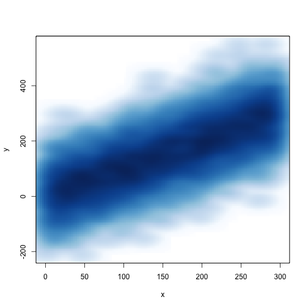
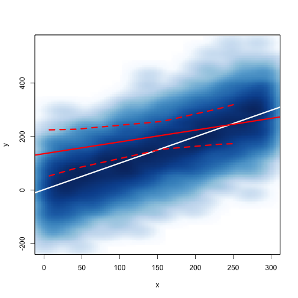
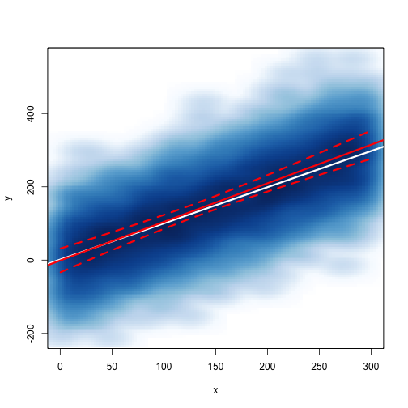
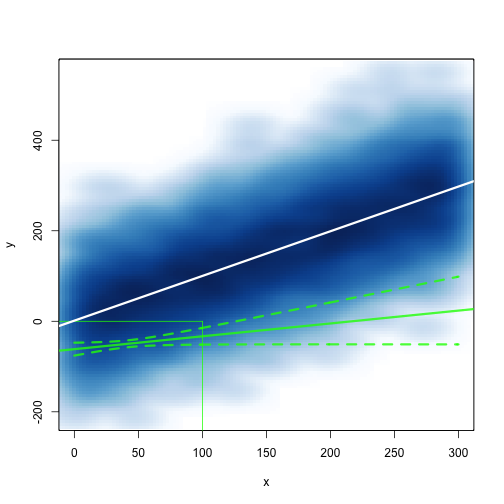
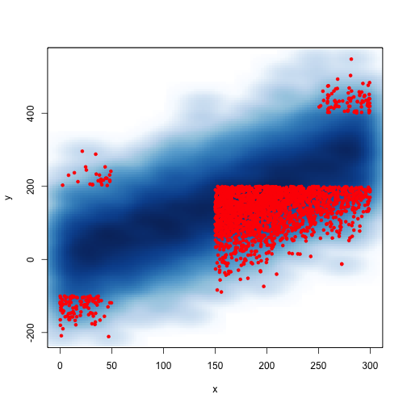
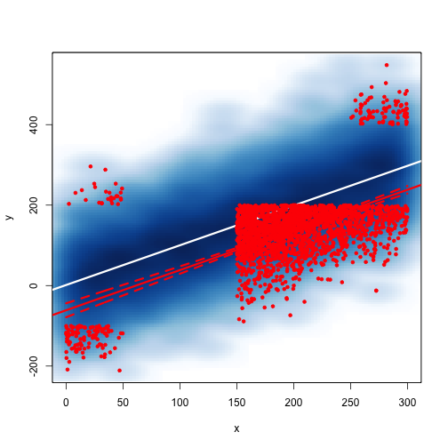
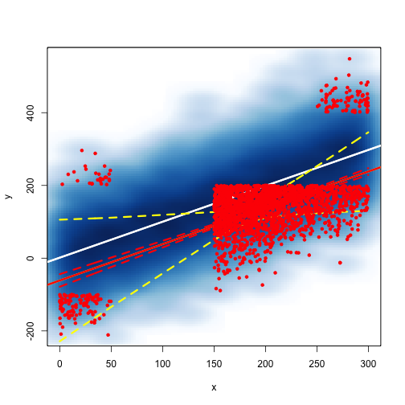
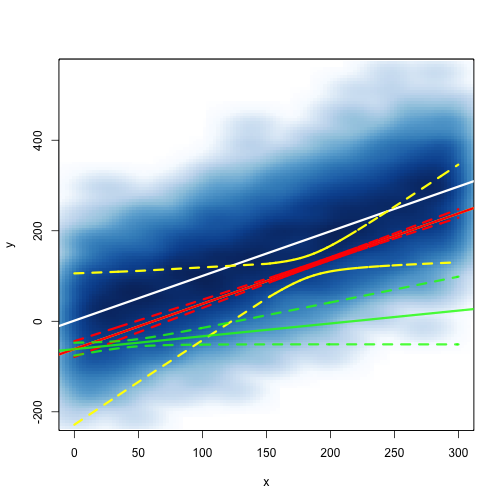

Examples of law of large numbers and finite population correction
------------------------------------------------------------------

Load the library and simulate some data


```r
library(survey)
x <- runif(10000, 0, 300)
y <- x + rnorm(10000, 0, 80)
sim.data <- data.frame(x = x, y = y)
sim.data <- sim.data[order(sim.data$x), ]
smoothScatter(sim.data, pch = "")
```

 


Fit a regression line using the population

```r
smoothScatter(sim.data, pch = "")
fit1 <- lm(y ~ x, data = sim.data)
abline(fit1, lwd = 3, col = "white")
```

 

```r
pred.fit1 <- predict(fit1, interval = "confidence")
```


Take 10 IID

```r
sample.10 <- sim.data[sample(1:10000, 10), ]
sample.10 <- sample.10[order(sample.10$x), ]
smoothScatter(sim.data, pch = "")
abline(fit1, lwd = 3, col = "white")


fit10 <- lm(y ~ x, data = sample.10)
abline(fit10, col = rgb(1, 0, 0, 1), lwd = 3)

pred.fit10 <- predict(fit10, interval = "confidence")
lines(sample.10$x, pred.fit10[, 2], lty = 2, col = rgb(1, 0, 0, 1), lwd = 3)
lines(sample.10$x, pred.fit10[, 3], lty = 2, col = rgb(1, 0, 0, 1), lwd = 3)
```

 


Take 100 IID

```r
sample.100 <- sim.data[sample(1:10000, 100), ]
sample.100 <- sample.100[order(sample.100$x), ]


# plot(sample.100 , pch = 20, col = rgb(1, 0, 0, 0.3))
smoothScatter(sim.data, pch = "", col = "white")
abline(fit1, lwd = 3, col = "white")


fit100 <- lm(y ~ x, data = sample.100)
abline(fit100, col = rgb(1, 0, 0, 1), lwd = 3)

pred.fit100 <- predict(fit100, interval = "confidence")
lines(sample.100$x, pred.fit100[, 2], lty = 2, lwd = 3, col = rgb(1, 0, 0, 1))
lines(sample.100$x, pred.fit100[, 3], lty = 2, lwd = 3, col = rgb(1, 0, 0, 1))
```

 


Take 1000 IID 

```r
sample.100 <- sim.data[sample(1:10000, 100), ]
sample.100 <- sample.100[order(sample.100$x), ]

# plot(sample.100 , pch = 20, col = rgb(1, 0, 0, 0.3))
smoothScatter(sim.data, pch = "")
abline(fit1, lwd = 3, col = "white")


fit100 <- lm(y ~ x, data = sample.100)
abline(fit100, col = rgb(1, 0, 0, 1), lwd = 3)

pred.fit100 <- predict(fit100, interval = "confidence")

lines(sample.100$x, pred.fit100[, 2], lty = 2, col = rgb(1, 0, 0, 1), lwd = 3)
lines(sample.100$x, pred.fit100[, 3], lty = 2, col = rgb(1, 0, 0, 1), lwd = 3)
```

 


A complex survey design with clustering
----------------------------------------

A biased sampling of 100

```r
smoothScatter(sim.data, pch = "")
lines(x = c(100, 100), y = c(-300, 0), col = "green")
lines(x = c(-50, 100), y = c(0, 0), col = "green")
```

 


```r
smoothScatter(sim.data, pch = "")

lines(x = c(100, 100), y = c(-300, 0), col = "green")
lines(x = c(-50, 100), y = c(0, 0), col = "green")

bias.100 <- sim.data[sim.data$x < 100 & sim.data$y < 0, ]
dim.b <- 1:nrow(bias.100)
bias.100 <- bias.100[sample(dim.b, size = 100), ]
bias.100 <- bias.100[order(bias.100$x), ]

fit.bias.100 <- lm(y ~ x, data = bias.100)
abline(fit.bias.100, col = rgb(0, 1, 0, 0.8), lwd = 3)
abline(fit1, lwd = 3, col = "white")


newdata <- data.frame(x = 0:300, y = rep(0, 301))

pred.bias.100 <- predict(fit.bias.100, newdata = newdata, interval = "confidence")

lines(0:300, pred.bias.100[, 2], lty = 2, col = rgb(0, 1, 0, 0.8), lwd = 3)
lines(0:300, pred.bias.100[, 3], lty = 2, col = rgb(0, 1, 0, 0.8), lwd = 3)
```

 


Reducing the bias by including information about clustering


Define clusters

```r
cluster1 <- sim.data[sim.data$x < 50 & sim.data$y < -100, ]

cluster2 <- sim.data[sim.data$x < 50 & sim.data$y > 200, ]

cluster3 <- sim.data[sim.data$x > 250 & sim.data$y > 400, ]

cluster4 <- sim.data[sim.data$x > 250 & sim.data$y < 0, ]

cluster5 <- sim.data[sim.data$x > 150 & sim.data$y < 200, ]

comp.des <- rbind(cluster1, cluster2, cluster3, cluster4, cluster5)

comp.des <- cbind(comp.des, c(rep(1, nrow(cluster1)), rep(2, nrow(cluster2)), 
    rep(3, nrow(cluster3)), rep(4, nrow(cluster4)), rep(5, nrow(cluster5))))

colnames(comp.des)[3] <- "cluster"
smoothScatter(sim.data, pch = "")
# abline(fit1, col = 'white', lwd = 3)
points(comp.des$x, comp.des$y, pch = 20, col = "red")
```

 


Define a survey object with a simple design

```r
smoothScatter(sim.data, pch = "")
abline(fit1, col = "white", lwd = 3)
comp.des <- comp.des[order(comp.des$x), ]

simple.des <- svydesign(id = ~1, data = comp.des)
```

```
## Warning: No weights or probabilities supplied, assuming equal probability
```

```r

simple.lm <- svyglm(y ~ x, simple.des)

abline(simple.lm, col = "red", lwd = 3)

pred.simple <- predict(simple.lm, interval = "confidence")

lines(comp.des$x, pred.simple - 1.96 * sqrt(attr(pred.simple, "var")), lty = 2, 
    col = "red", lwd = 3)
lines(comp.des$x, pred.simple + 1.96 * sqrt(attr(pred.simple, "var")), lty = 2, 
    col = "red", lwd = 3)
points(comp.des$x, comp.des$y, pch = 20, col = "red")
```

 


Define a survey object with a complex design with clustering

```r
smoothScatter(sim.data, pch = "")
abline(fit1, lwd = 3, col = "white")

abline(fit1, col = "white", lwd = 3)
clust.des <- svydesign(id = ~cluster, data = comp.des)
```

```
## Warning: No weights or probabilities supplied, assuming equal probability
```

```r

clust.lm <- svyglm(y ~ x, clust.des)

abline(clust.lm, col = "yellow", lwd = 3)
abline(simple.lm, col = "red", lwd = 3)

lines(comp.des$x, pred.simple - 1.96 * sqrt(attr(pred.simple, "var")), lty = 2, 
    col = "red", lwd = 3)
lines(comp.des$x, pred.simple + 1.96 * sqrt(attr(pred.simple, "var")), lty = 2, 
    col = "red", lwd = 3)


pred.clust <- predict(clust.lm, interval = "confidence")

lines(comp.des$x, pred.clust + 1.96 * sqrt(attr(pred.clust, "var")), lty = 2, 
    col = "yellow", lwd = 3)
lines(comp.des$x, pred.clust - 1.96 * sqrt(attr(pred.clust, "var")), lty = 2, 
    col = "yellow", lwd = 3)
points(comp.des$x, comp.des$y, pch = 20, col = "red")
```

 


```r
# Show the biased estimate for comparision
smoothScatter(sim.data, pch = "")
abline(fit1, lwd = 3, col = "white")


abline(clust.lm, col = "yellow", lwd = 3)
abline(simple.lm, col = "red", lwd = 3)

lines(comp.des$x, pred.simple - 1.96 * sqrt(attr(pred.simple, "var")), lty = 2, 
    col = "red", lwd = 3)
lines(comp.des$x, pred.simple + 1.96 * sqrt(attr(pred.simple, "var")), lty = 2, 
    col = "red", lwd = 3)


pred.clust <- predict(clust.lm, interval = "confidence")

lines(comp.des$x, pred.clust + 1.96 * sqrt(attr(pred.clust, "var")), lty = 2, 
    col = "yellow", lwd = 3)
lines(comp.des$x, pred.clust - 1.96 * sqrt(attr(pred.clust, "var")), lty = 2, 
    col = "yellow", lwd = 3)

lines(0:300, pred.bias.100[, 2], lty = 2, col = rgb(0, 1, 0, 0.8), lwd = 3)
lines(0:300, pred.bias.100[, 3], lty = 2, col = rgb(0, 1, 0, 0.8), lwd = 3)
abline(fit.bias.100, col = rgb(0, 1, 0, 0.8), lwd = 3)
```

 

